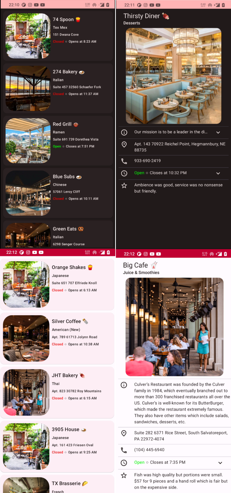

<!-- ABOUT THE PROJECT -->
## Apetito 🍕

Apetito is a simple Android app showcasing different restaurants. 
- Build in Kotlin with the help of Flows and Jetpack Compose
- Fetches data from this [random api](https://random-data-api.com/api/restaurant/random_restaurant?size=5) endpoint

  

## Code 💻
Check out the app code [here](https://github.com/vasilije15/apetito/tree/master/app/src/main/java/com/vaske/restaurants).

Check out the simple tests [here](https://github.com/vasilije15/apetito/blob/master/app/src/test/java/com/vaske/restaurants/ui/RestaurantsViewModelTest.kt) and [here](https://github.com/vasilije15/apetito/tree/master/app/src/androidTest/java/com/vaske/restaurants/ui/components).

Compose components [here](https://github.com/vasilije15/apetito/tree/master/app/src/main/java/com/vaske/restaurants/ui/components).

